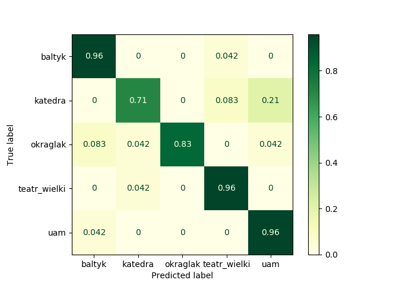

# Poznan's buildings classificator

Project from Advanced Image Processing subject to classify 5 popular buildings in Poznan using Bag of Words model.

## Requirements
* opencv-contrib-python 3.4.2.16
* scikit-learn 0.22.2
* numpy 1.17.4

This project is used SIFT detector, so it is important to have old version of OpenCV.

## Results
The best results on this train dataset was with image with width resized to 400px. Vocabulary contains 44 words and I used linear SVC model to classify buildings.

Scores on data are presented below:
| metrics     | Train data          | Test data  |
| ------------- |:-------------:|:-----:|
| **accuracy [%]** | 98.73 | 88.33 |
| **precision [%]**     | 98.75      |  89.14 |
| **recall [%]** | 98.73    |  88.33 |

Confusion matrix of test data:

